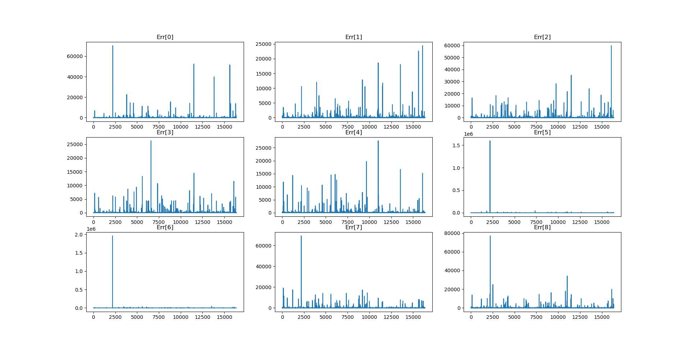
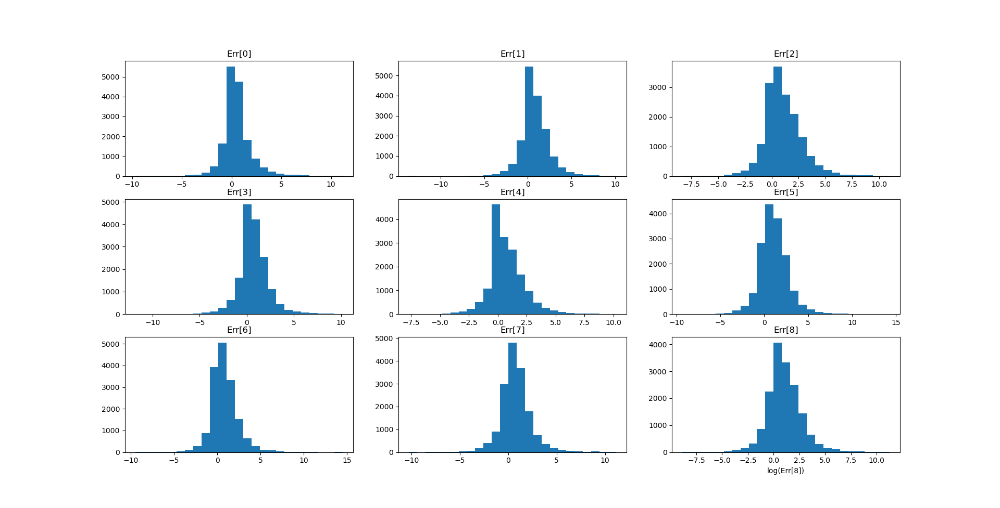

# 太极图形课S1-大作业

## 作业来源

> I. 视频[《编程语言还能做 MG 动画? 太极图形课片头是如何用 Taichi 制作的》](ttps://www.bilibili.com/video/BV15q4y1m7FP?share_source=copy_web)中提到可以先将模拟跑完再根据最后一帧的粒子位置从头染色，于是我尝试在`Taichi`官方仓库的[MPM88](https://github.com/taichi-dev/taichi/blob/master/python/taichi/examples/simulation/mpm88.py)的基础上修改代码，让粒子从高出自由落下，经过多层档板和碰撞，依照颜色落入不同的桶中。因为效果类似若干年前彩虹糖的广告，取名为`skittles_mpm` 。

> II. 尝试利用StVK模型对3维弹性体进行模拟。

## 运行方式
### 运行环境：
> `[Taichi] version 0.8.8, llvm 10.0.0, commit 7bae9c77, linux, python 3.8.10`

### 运行：
> I. 使用命令：`python skittles_mpm.py` 可以看到紫色粒子经过多层档板和碰撞落入不同的桶中，在几乎所有粒子都落入桶中之后按 `r` 重置粒子初始位置并按照上一次落入桶中的结果染色。

> II. 使用命令：`python fem_stvk_3d.py` 可以看到若干用红色小球表示的节点，但是模拟失败了，物体接触边界后无法弹起，在一段时间后直接炸开，可能是网格设的不好，可能是写出BUG了。
## 效果展示

> 可以看到，即使使用了相同的初始化参数，第二次模拟也不能保证所有粒子按照颜色落入相应的桶中，这说明计算过程中出现了误差或者出现了逻辑上的错误。

> 随后我记录下第一次模拟在第 15000 时间步时第 个粒子的速度 ，对之后每一次重启后的模拟记录第 15000 时间步时第 个粒子的速度 ，令。从后面的图表可以得知，对结果造成较大误差的粒子出现的位置比较固定，多次模拟中误差的数量分布有相同的特征。

> 

> 
> 

## 整体结构

```
-LICENSE
-|data
-README.MD
-skittles_mpm.py
-fem_stvk_3d.py
```

## 实现细节：

> 在网格上处理碰撞，对于需要处理碰撞的网格上的速度 ，令，随后令，具体实现里取了。
